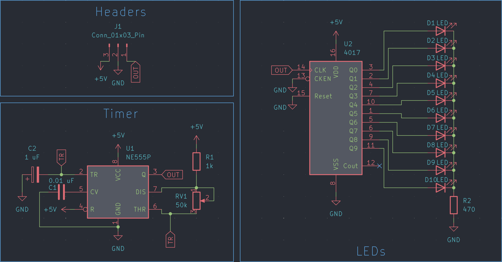
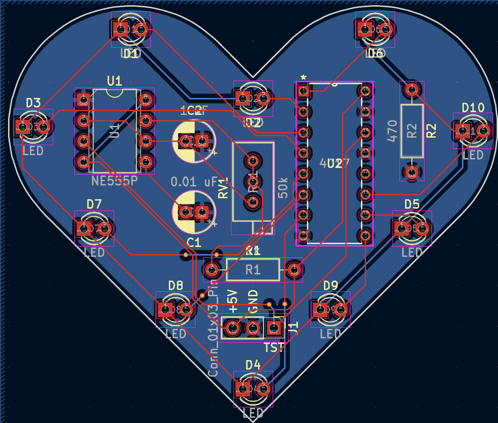

# LED Chaser #
Made by following the tutorial from Hack Club Blueprint.  
Gerbers were generated matching JLCPCB guidelines.

## Schematic ##

## PCB ##

  
(Snoopy silkscreen removed for clarity)

